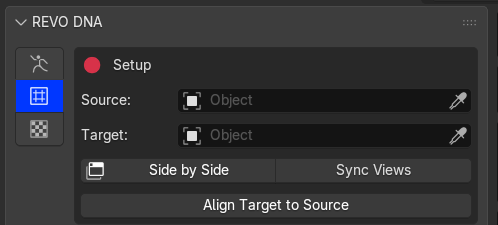
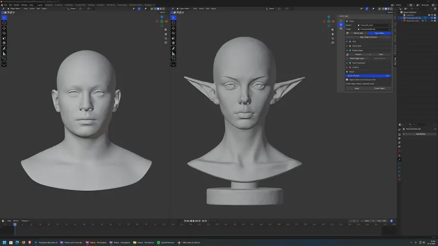
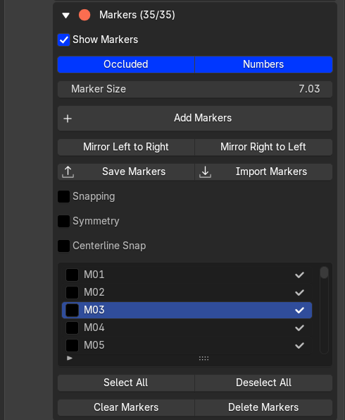
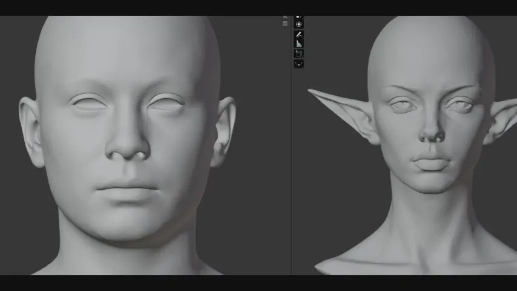

# Markers

Use Conform for heads or bodies with different topology. **Already using compatible MetaHuman UVs? Use [Conform by UVs](../metahuman/uv-conform.md) directly—markers are optional.**

## Set up

1. Set **Source** to the mesh whose topology you want to keep.
2. Set **Target** to the scan or sculpt whose shape you want.
3. Use **Side by Side** to view both. Enable **Sync Views** to rotate them together.

{.doc-screenshot .tool-ui-screenshot}

Set Source and Target

{.doc-screenshot}

Rotate both views together with Sync Views

If the Target needs repair, use **Scan Preparation > Repair Scan Copy** before placing markers, then select the repaired copy as Target.

{.doc-screenshot .tool-ui-screenshot}

Inspect or repair the Target before placing markers

## Place and move markers

Click **Add Markers**. Place matching landmarks on Source and Target in the same order: eye corners, lips, nose and ears.

**To move a marker, grab and drag it while Add Markers is active.** You do not need to delete and replace it.

{.doc-screenshot .tool-ui-screenshot}

Marker placement, visibility and selection controls

| Control | What it does |
| --- | --- |
| **Show Markers** | Hide or show all marker dots and numbers without deleting them. |
| **Occluded** | Show markers through the mesh. |
| **Numbers / Marker Size** | Adjust labels and dot size. |
| **Snapping** | Snap to vertices. Leave off for free placement on the surface. |
| **Centerline Snap** | Pull markers near the mesh's local centre onto it. Distance controls the range. It does not mirror markers. |
| **Symmetry** | Add linked opposite-side markers; moving one updates its partner. |

Symmetry uses each mesh's local X centre, so centre the meshes first. Existing independent markers are not paired automatically.

{.doc-screenshot}

Place matching markers with Symmetry

**Mirror Left to Right / Right to Left** copies checked markers across the mesh. With none checked, it uses all markers.

## Save or clear

**Save Markers** stores a file; **Import Markers** replaces the current set. Reuse it with meshes whose topology has not changed.

**Delete Markers** removes checked markers. **Clear Markers** removes all. Use **Select All / Deselect All** to change the selection.

Next: [Protect and conform](wrapping.md).
