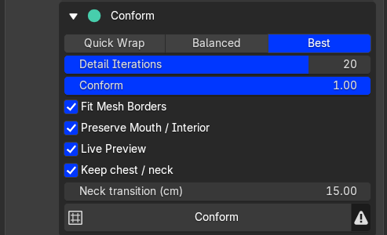
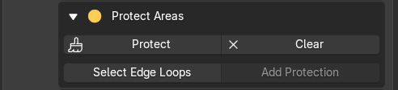
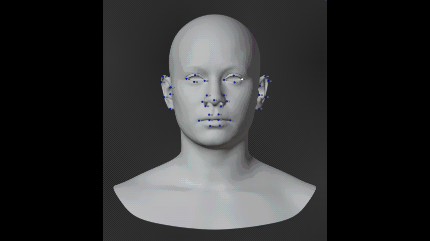
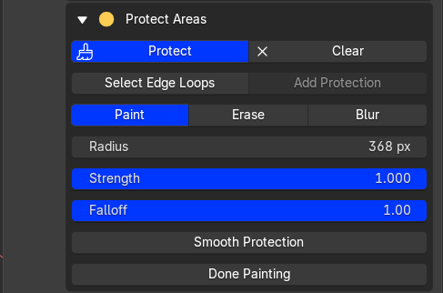
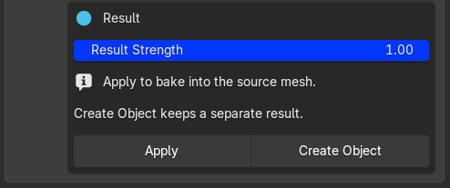

# Protect and conform

## Quality

| Setting | When to use it |
| --- | --- |
| **Quick Wrap** | Fastest. Check marker placement and get a rough fit. |
| **Balanced** | A balance between speed and fit. Start here. |
| **Best** | Slower, more thorough fitting. Compare it with Balanced; it is not always better. |

### Detail Iterations

Refines the shaping after the main fit. **More does not always mean better.** Try small increases, then compare the ears, eyelids and lips. Lower it if folds or creases get worse.

The range is **0–25**; **0** turns refinement off. Defaults are Quick Wrap **1**, Balanced **3**, Best **5**. Once you change the slider, your value applies to all three settings.

Click **Conform** again to try different settings. Each run starts from the original Source, so you do not need Undo.

{.doc-screenshot .tool-ui-screenshot}

Quality, Detail Iterations and Conform settings

## Three ways to protect areas

{.doc-screenshot .tool-ui-screenshot}

Paint protection or start from edge loops

1. **Paint:** click **Protect**, then paint areas you want to keep. Red means full protection; blue means none. Use **Erase** to remove it, **Blur** to brush-smooth it, or **Smooth Protection** to soften the whole mask.
{.doc-screenshot .tool-ui-screenshot}
2. **Edge loops:** click **Select Edge Loops**, Alt-click a loop, then **Add Protection**. Each additional click expands the protected band. Shift-Alt-click selects more loops.
{.doc-screenshot .tool-ui-screenshot}
3. **Neck Transition:** enable **Keep Chest / Neck** without painting. A larger distance makes a wider blend from the fixed attachment into the new shape. This needs an open attachment boundary.

You can combine these methods. **Clear** removes painted and loop protection; turn off **Keep Chest / Neck** separately. Click **Done Painting** before conforming.

{.doc-screenshot .tool-ui-screenshot}

Paint, erase and smooth the protection mask

## Conform and keep the result

Keep **Preserve Mouth / Interior** enabled for heads with a mouth cavity. **Fit Mesh Borders** fits open edges to the Target; it does not close holes.

Click **Conform**, inspect the result from several angles, and adjust **Result Strength** if needed. Incorrect marker pairs need correcting even with Best selected.

- **Apply** bakes the result into the Source mesh and updates its loaded lower LODs.
- **Create Object** makes a separate result mesh.

{.doc-screenshot .tool-ui-screenshot}

Apply to the Source or create a separate object

For DNA export, Apply to the imported Source, then [bake and export](../metahuman/export.md).
