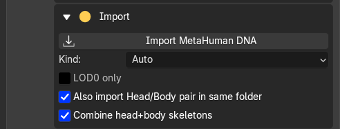
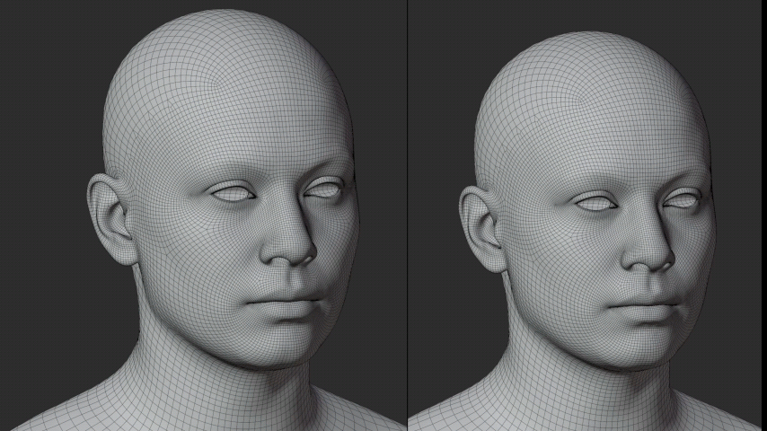

# Prepare Your Character

## Import your files

For a custom head sculpt with different topology, bring these three things into Blender:

1. **Your MetaHuman DNA:** open **MetaHuman Tools > Import** and import the head DNA from your MetaHuman Creator DCC Export. Enable the head/body pair option to include the body. Leave **LOD0 only** off to import all LODs.
2. **MetaHuman Conform Topology:** download [Epic's topology meshes from Fab](https://www.fab.com/listings/98f7b49d-f5dc-45c4-b590-52dbb4f951c0) and import the head FBX through **File > Import > FBX**. This is the mesh you will fit to your sculpt; it does not replace your DNA import.
3. **Your custom head sculpt:** import the sculpt using Blender's matching file importer, such as FBX or OBJ.

Check the Character field and save your Blender file.

{.doc-screenshot .tool-ui-screenshot}

Import MetaHuman DNA

Keep the original DNA and REVO DNA's sidecar files with the project. They are needed for rig playback, LOD updates and export.

## Choose your workflow

- **Different topology:** in **Conform**, set the imported Fab head mesh as **Source** and your sculpt as **Target**. Add [matching markers](../conform/points.md), then **Conform > Apply**. Next, in **MetaHuman Tools**, choose **Head**, set that fitted topology mesh as **Target**, and click **Conform by UVs** to transfer the shape to your DNA character.
- **Already using MetaHuman topology with compatible UVs:** import your DNA and sculpt, then use [Conform by UVs](../metahuman/uv-conform.md) directly. **You can skip the Fab template, Conform Tools and markers.**

Both routes work with heads and bodies. Marker conforming is also available for MetaHuman targets if preferred.

You can also [sculpt directly](../metahuman/sculpt.md). After editing, check the LODs and facial movement, then [bake and export](../metahuman/export.md).

{.doc-screenshot}

Custom head shapes using MetaHuman topology

