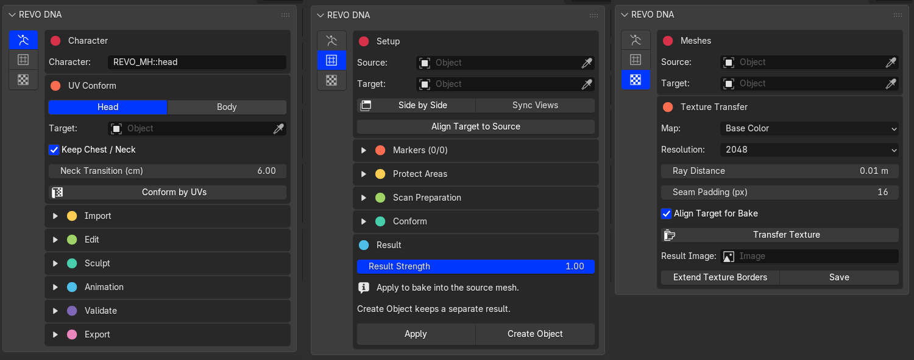
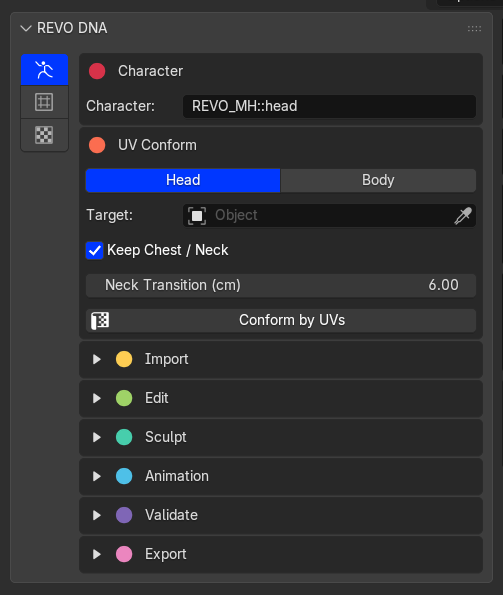
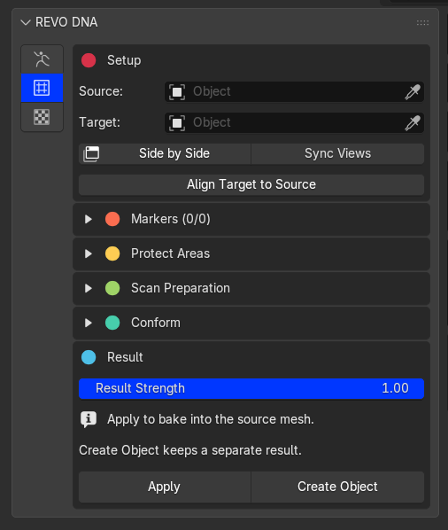
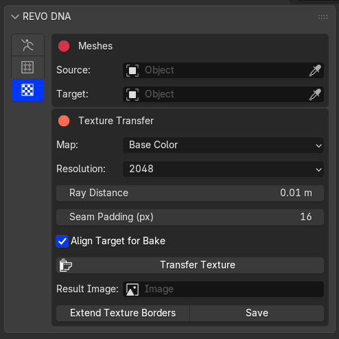

# Tool UI

Open the 3D Viewport sidebar with **N**, then select **REVO DNA**. Use the four buttons on the left to switch tabs.

{.doc-screenshot}

MetaHuman Tools, Conform and Textures

## 1. MetaHuman Tools

Import DNA, conform by UVs, sculpt, check LODs and animation, then bake and export your character.

{.doc-screenshot .tool-ui-screenshot}

MetaHuman Tools

## 2. Conform

Fit a head or body to a custom sculpt or scan using markers. Protect areas, preview the fit, then Apply or Create Object.

{.doc-screenshot .tool-ui-screenshot}

Conform

## 3. Textures

Transfer textures from the Target to the Source, extend texture borders and save the images.

{.doc-screenshot .tool-ui-screenshot}

Textures

## 4. Support

Open the documentation, join the [REVO Discord community](https://discord.gg/EUXecvQ8V), or visit [Revolutionart on ArtStation](https://www.artstation.com/revolutionart).
