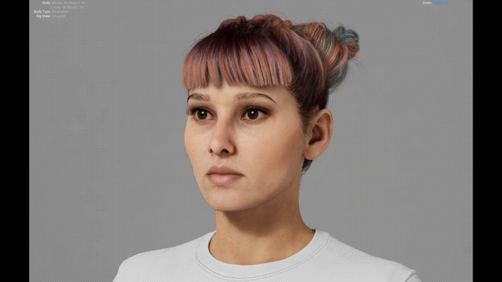

# REVO DNA

**MetaHuman Editing & Mesh Conforming**

{.doc-screenshot}

REVO DNA

REVO DNA is a Blender addon for creating custom characters from MetaHuman heads and bodies. Import a MetaHuman, reshape it with your own sculpt or scan, and export the edited DNA back to Unreal Engine.

It brings together mesh conforming, sculpting, LOD updates, facial animation previews and texture transfer. You can check your character's shape and expressions before exporting.

Start with [installation](getting-started/installation.md), then [Prepare Your Character](getting-started/first-character.md) to import your files and choose how to edit them.

REVO DNA **1.0.0** supports **Blender 4.2–5.2 on Windows x64**, with two download options. See [requirements](help/requirements.md).

{.doc-screenshot}

MetaHuman character result in Unreal Engine

