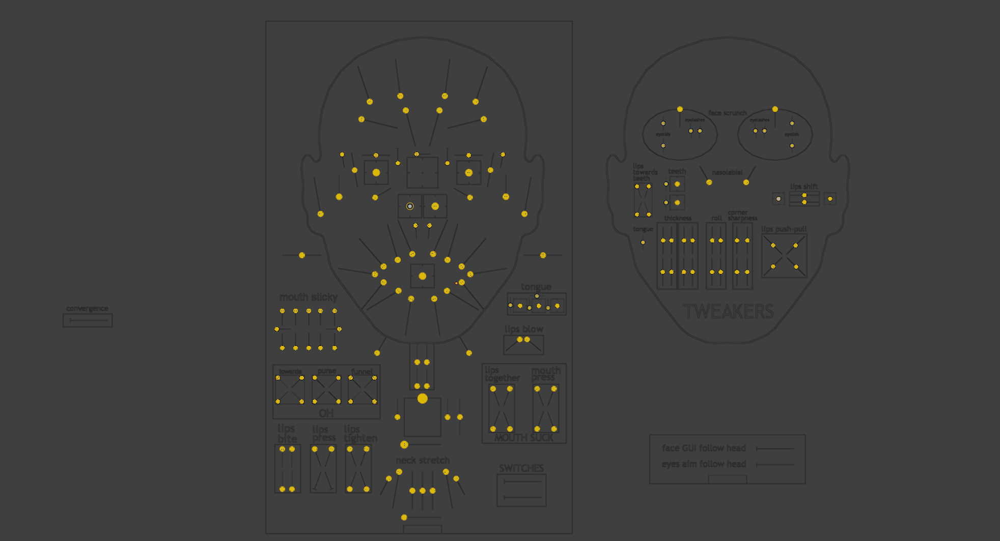
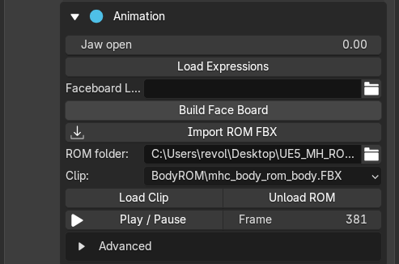
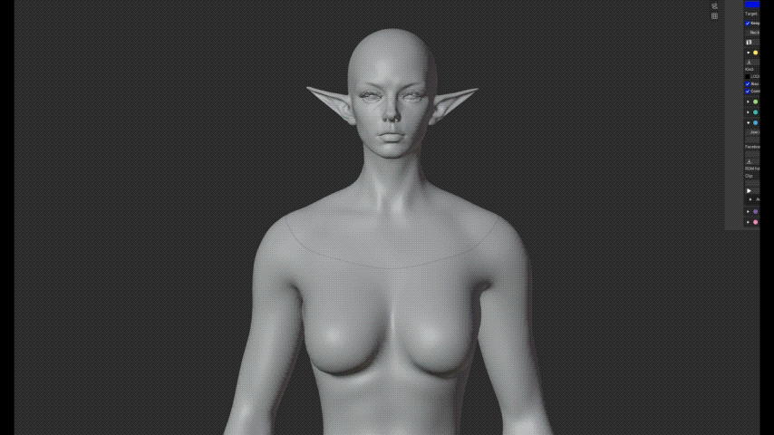

# Animation and Faceboard

Use **Animation**, below Sculpt, to check facial movement after editing.

## Faceboard

**First-time setup:** [download and select Epic's Faceboard layout](faceboard-setup.md). The layout is not bundled with REVO DNA.

1. Click **Build Faceboard**.
2. Click **Edit Board**.
3. Move the yellow controls in Pose Mode.

{.doc-screenshot}

Faceboard controls

Edit Board starts rig preview automatically. If the face does not move, check the Character field and click Edit Board again. Undo or loading a file can stop preview.

The layout requires Epic MetaHuman for Maya's local **faceboard.json**. Select it in **Faceboard Layout** if it is not found automatically.

**Preview Face Board** is the manual preview switch under Advanced; you normally do not need it. Use **Neutral** to reset controls.

## Optional control test

**Build Control ROM** creates a control animation to test facial movement. It is optional and does not download or create Epic's ROM FBX.

## Load a clip

Use **Load Clip** to load a compatible animation FBX, or select one from **ROM Folder**. See [where to get ROM files](rom-files.md).

{.doc-screenshot .tool-ui-screenshot}

Load, play and unload animation clips

**Unload ROM** removes the loaded clip and restores the state from before loading it. Skeletal clips may not include all facial correctives; also check the Faceboard.

{.doc-screenshot}

Check facial movement after editing

A loaded clip is not included in DNA export, and the current animation frame is not exported as the neutral face. Still inspect neutral before [baking and exporting](export.md).
