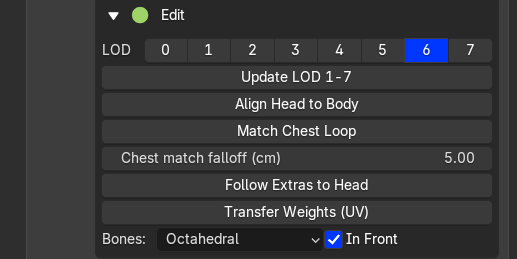
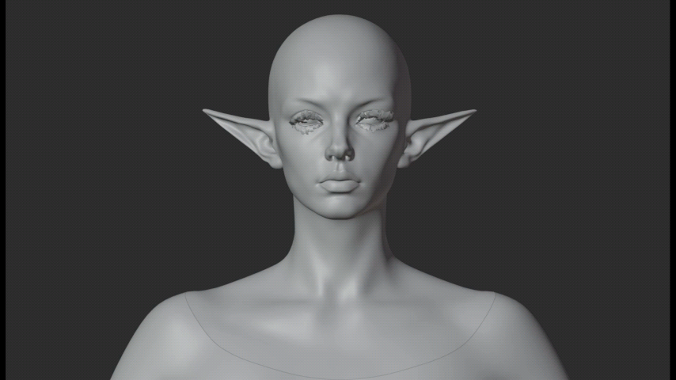
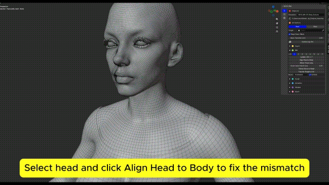

# Edit and LODs

## Compare LODs

A standard MetaHuman has **8 head LODs (0–7)** and **4 body LODs (0–3)**. There is no body LOD4.

The LOD buttons switch visibility; they do not build or load meshes. Leave **LOD0 only** off before importing to include all levels.

{.doc-screenshot .tool-ui-screenshot}

LOD selection and editing controls

For a head/body pair, the buttons follow the standard Unreal **LODSync** mapping:

| Head LOD | Body LOD |
| --- | --- |
| 0 or 1 | 0 |
| 2 or 3 | 1 |
| 4 or 5 | 2 |
| 6 or 7 | 3 |

After manual sculpting, use **Update LOD 1-7** to check them before baking. Export includes the full LOD set.

{.doc-screenshot}

Compare the character across LODs

## Alignment and display

- **Align Head to Body / Match Chest Loop:** align the attachment and adjust the neck boundary.

{.doc-screenshot}

Align Head to Body at the chest attachment

- **Follow Extras to Head:** move eyes, lashes, teeth and other associated meshes with the edited head. Check neutral and jaw-open poses.
- **Bones / In Front:** change bone display only.
- **Bone Size:** scale B-Bone or Envelope display. **1** restores the original size.
