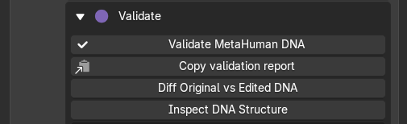
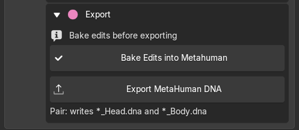

# Export MetaHuman DNA

1. **Apply** any Conform preview to the imported Source.
2. **Unweld Neck Seam** if you used a joined sculpt.
3. Check the neutral face, lower LODs and facial movement.
4. In **Export**, click **Bake Edits into Metahuman** for each edited DNA mesh.
5. Click **Validate MetaHuman DNA** and resolve reported problems.
6. **Export MetaHuman DNA** to a new filename, then check it in Unreal.

{.doc-screenshot .tool-ui-screenshot}

Validate the character before export

**Bake before exporting.** Apply commits the Conform result to the mesh; Bake prepares the edited character for DNA export.

{.doc-screenshot .tool-ui-screenshot}

Bake edits, then export MetaHuman DNA

Keep the original DNA and REVO DNA sidecars. Head and body export as separate DNA files. A combined DNA is for inspection only.

ROM clips are not included in DNA export. Textures must be saved separately from the [Textures tab](../textures.md).

If export reports a problem, open **REVO DNA Export Report** in Blender's Text Editor.
