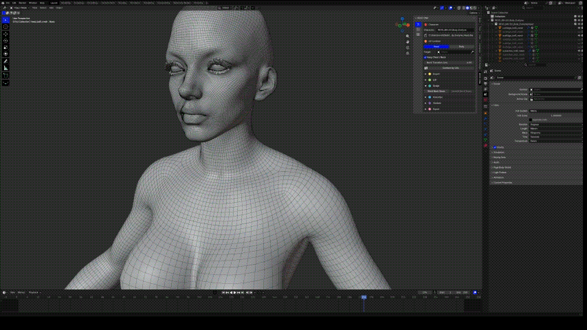

# Sculpt

Sculpt the imported **LOD0 head or body**. Keep the vertex count and connections unchanged: do not remesh, use Dyntopo, or add/delete vertices.

## Sculpt across the neck

{.doc-screenshot .tool-ui-screenshot}

Weld and Unweld Neck Seam

1. Align the head and body.
2. Click **Weld Neck Seam** to join them temporarily.
3. Sculpt across the seam.
4. Click **Unweld Neck Seam** to return to separate meshes.

{.doc-screenshot}

Join the neck seam for sculpting

Repeat as needed. After sculpting, check lower LODs and facial movement.

Before exporting, open **Export** and **Bake Edits into Metahuman** for each edited DNA mesh. See [export steps](export.md).
