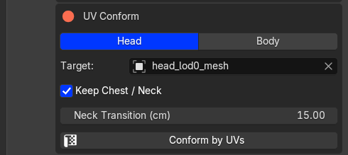
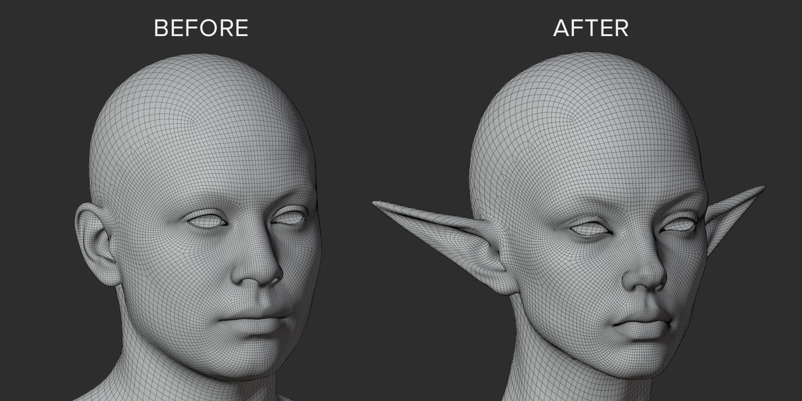

# Conform by UVs

**Use this for a custom head or body already using MetaHuman topology with compatible MetaHuman UVs. No markers or Conform Tools required.**

1. Open **MetaHuman Tools** and choose **Head** or **Body**.
2. Set your custom sculpt as **Target**.
3. Enable **Keep Chest / Neck** if the attachment should stay fixed. **Neck Transition** controls the width of the blend.
4. Click **Conform by UVs**.

{.doc-screenshot .tool-ui-screenshot}

Select Head or Body and the UV Conform target

The result is applied directly to the imported mesh. Loaded lower LODs and associated meshes follow the edit. Inspect the ears, eyes, mouth and neck before exporting.

Each click starts from the original imported shape and uses the Target's current shape. Change settings and run it again without Undo. Neck Transition here is independent of the second tab's setting.

For targets with unrelated topology or UVs, use [marker conforming](../conform/points.md).

Next: [check LODs](edit.md), then [bake and export](export.md).

{.doc-screenshot}

Head shape before and after conforming

