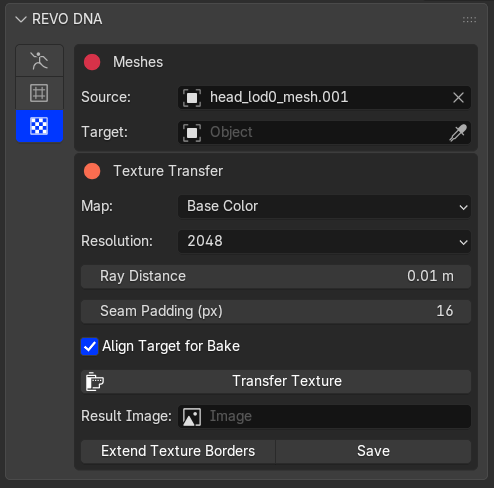

# Texture Transfer

**Textures is the third tab**, separate from MetaHuman Tools and Conform. Open it using the bottom button on the vertical sidebar. It has its own texture transfer, border extension and image saving tools. Source and Target selections are shared with Conform.

The detailed Target supplies the texture. The Source receives the baked image and needs a usable UV map.

1. Set Source and Target and check their alignment.
2. Choose Base Color or Normal.
3. Set the output resolution, ray distance and seam padding.
4. Click **Transfer Texture**.
5. Inspect the image for missed areas or projection from the wrong surface.
6. Use **Extend Texture Borders** if needed, then **Save Texture**.

{.doc-screenshot .tool-ui-screenshot}

Texture Transfer and image saving controls

Use enough ray distance to reach the detail mesh without hitting unrelated surfaces. Seam padding and border extension fill pixels outside the UV islands to reduce seams when the texture is filtered.

Border extension cannot repair missing detail inside an island. Correct alignment or the bake distance and transfer again if the wrong surface was captured.

The image must be saved separately from the DNA export.

[Video tutorials](tutorials.md)
