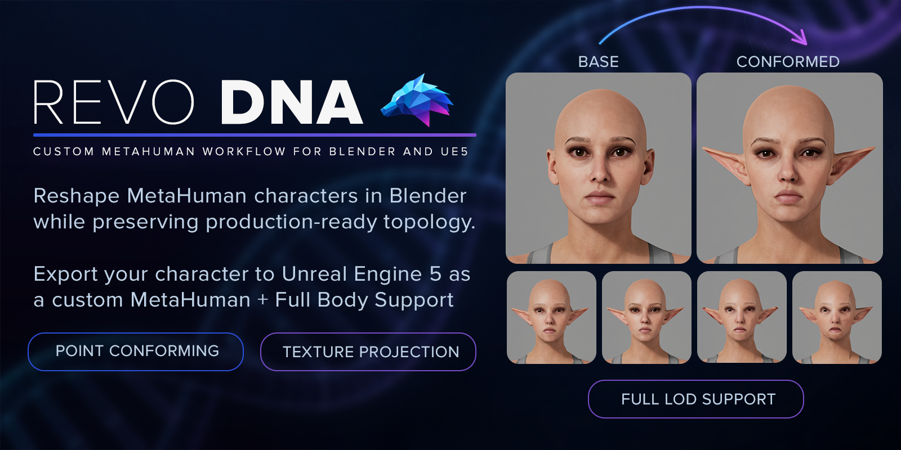

# Full workflow tutorial

Follow the complete REVO DNA workflow, from Blender setup to your custom MetaHuman in Unreal Engine.

[{.doc-screenshot}](https://youtu.be/wptz25xv7-c)

**[Watch the full workflow on YouTube](https://youtu.be/wptz25xv7-c)**
